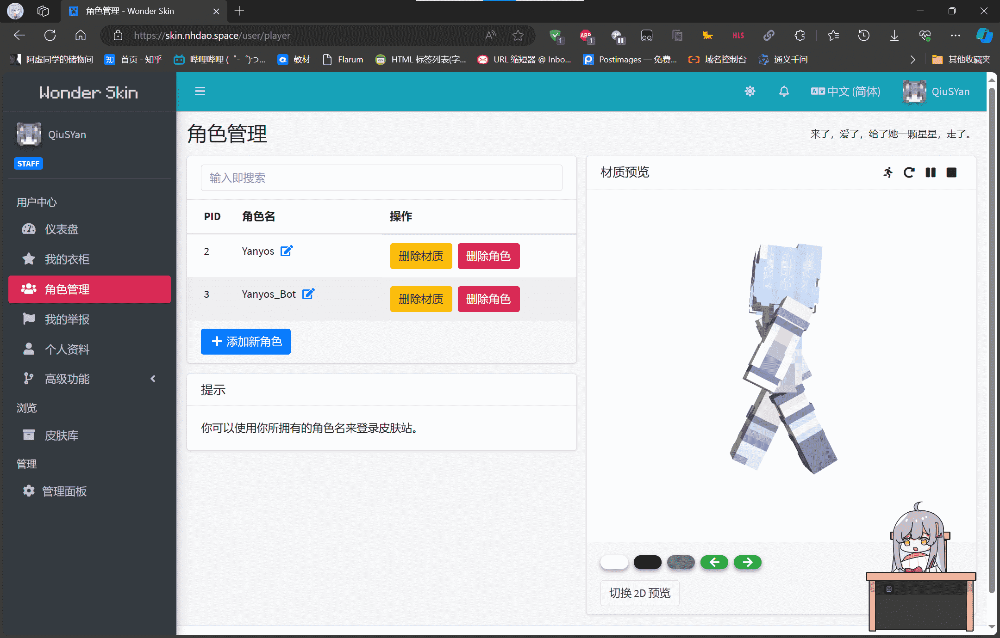
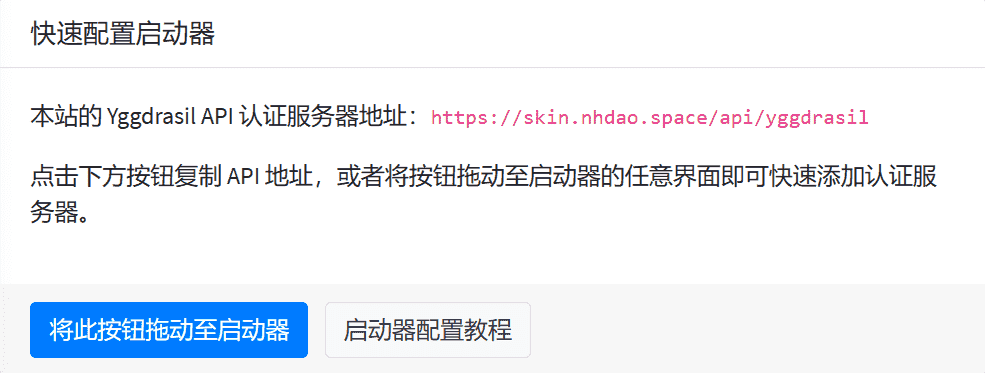
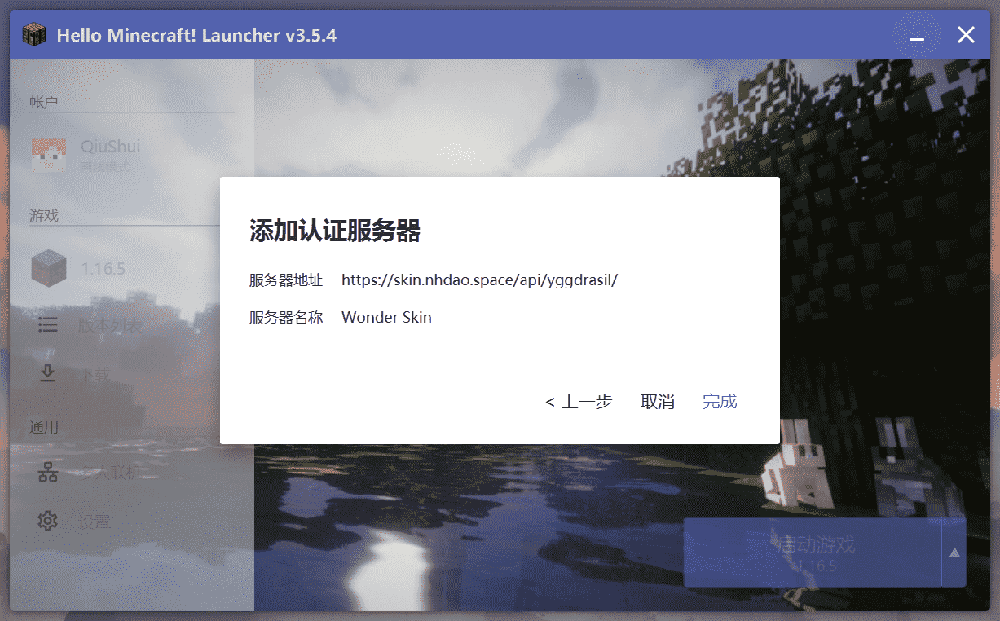
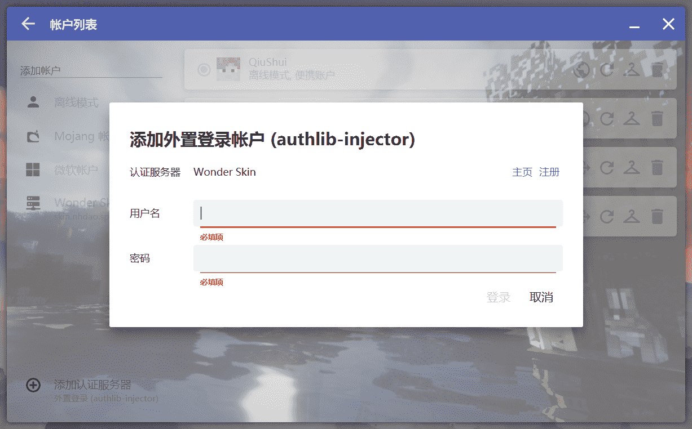
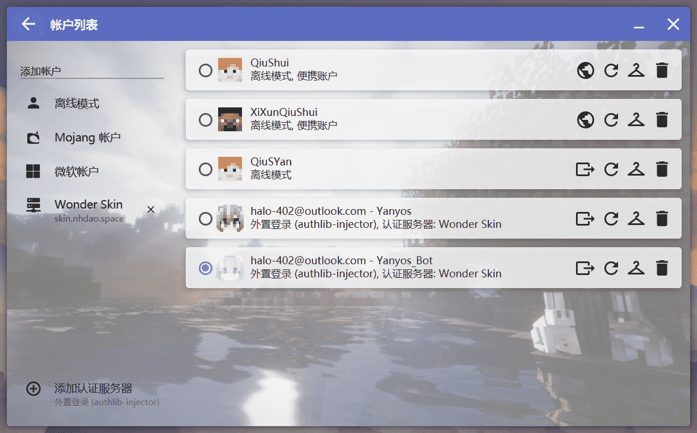

# 如何登录服务器？

我先在这里给出昕夕亭的信息：

| 服务端类型 | 服务端版本 | 支持的客户端类型                                  | 支持的客户端版本                                 | 客户端是否需要安装Mod |
| ---------- | ---------- | ------------------------------------------------- | ------------------------------------------------ | --------------------- |
| Paper      | 1.16.5     | Java版 Vanilla（原版） / Fabric / Forge 基岩版 | Java版 1.8.x - latest 基岩版 1.20.40 - latest | 是                    |

| 连接地址                       | 正版验证 | 白名单                           | 外置登录                           |
| ------------------------------ | -------- | -------------------------------- | ---------------------------------- |
| Java版：play.nhdao.space:19035 | 已禁用   | 已启用                           | 已启用                             |
| 基岩版：play.nhdao.space:19035 |          | 请联系管理员将您的角色加入白名单 | [皮肤站](https://skin.nhdao.space) |

?> **由此可见，玩家其实有两种方式来登入服务器**，分别是 **离线模式登录** 和 **第三方验证服务器登录**（使用皮肤站账号登录）。

!> 关于客户端游戏版本选择，详见 [如何选择游戏版本？](version.md)

!> 鉴于Minecraft 1.16.5 对使用离线模式账户启动游戏的玩家做出了限制（无法通过正常方式参与多人游戏），我们建议您选择**使用皮肤站账号**登录服务器。

## 使用皮肤站账号登录

**第一步** 确保你已在皮肤站**注册了账户**，**创建了你的游戏角色** 并选择了一款心仪的皮肤 （如图示）

> 

**第二步** 切换到皮肤站的 **仪表盘** 页面 并 启动HMCL

> 
>
> 

**第三步** 切换到HMCL的 **账户** 界面，选择 **添加账户** —— **Wonder Skin**

> 

**第四步** 填入你的皮肤站账户 **邮箱** 和 皮肤站账户密码。

> 

完成。

## 以离线模式登录

离线模式登录服务器很简单，以HMCL为例，左上角【账户】— 【添加离线模式账户】，输入你想要的游戏名并保存，最后启动游戏即可。
