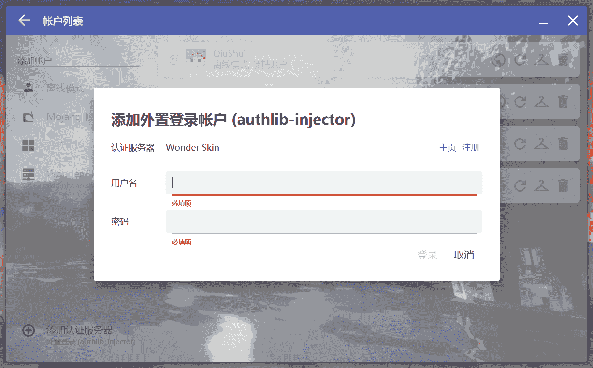
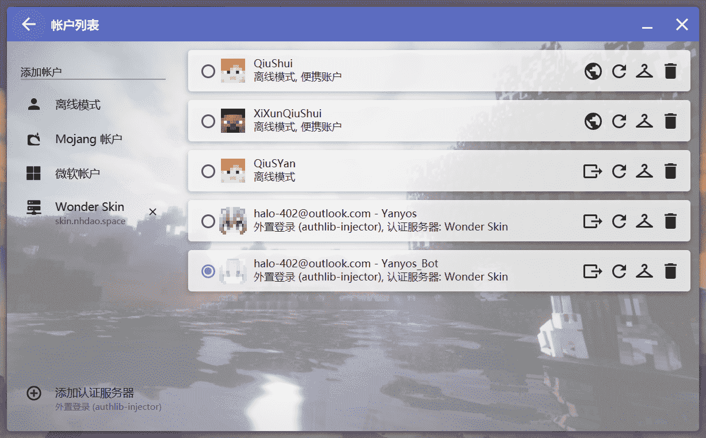

# 如何登录服务器？

我先在这里给出昕夕亭的信息：

<table>
    <tr>
        <th>服务端类型</th>
        <th>服务端版本</th>
        <th>支持的客户端类型</th>
        <th>兼容的游戏版本</th>
        <th>外置登录</th>
    </tr>
    <tr>
        <td>Paper</td>
        <td>1.16.5</td>
        <td>
            <ul>
                <li>Java版 Vanilla / Forge / Fabric端</li>
                <li>基岩版</li>
            </ul>
        </td>
        <td>
            <ul>
                <li>Java版：1.7.2 - 1.20.4</li>
                <li>基岩版：1.20.40 - latest</li>
            </ul>
        </td>
        <td>
            <ul>
                <li>已启用</li>
                <li><a href="https://skin.nhdao.space" target="_blank">皮肤站链接</a></li>
            </ul>
        </td>
    </tr>
</table>
<table>
    <tr>
        <th>客户端是否需要安装Mod</th>
        <th>连接地址</th>
        <th>正版验证</th>
        <th>白名单</th>
    </tr>
    <tr>
        <td>
            <ul>
                <li>Java版：是</li>
                <li>基岩版：无法安装</li>
            </ul>
        </td>        
        <td>
            <b>play.nhdao.space:19035</b>
        </td>
        <td>
            已禁用
        </td>
        <td>
            <ul>
                <li>已启用</li>
                <li>请联系管理员将您的角色加入白名单</li>
            </ul>
        </td>
    </tr>
</table>

?> **由此可见，玩家其实有两种方式来登入服务器**，分别是 **离线模式登录** 和 **第三方验证服务器登录**（使用皮肤站账号登录）。

!> 关于客户端游戏版本选择，详见 [如何选择游戏版本？](version.md)

!> 鉴于Minecraft 1.16.5 对使用离线模式账户启动游戏的玩家做出了限制（无法通过正常方式参与多人游戏），我们建议您选择**使用皮肤站账号**登录服务器。

## 使用皮肤站账号登录

**第一步** 确保你已在皮肤站**注册了账户**，**创建了你的游戏角色** 并选择了一款心仪的皮肤 （如图示）

> 

**第二步** 切换到皮肤站的 **仪表盘** 页面 并 启动HMCL

> 
>
> 

**第三步** 切换到HMCL的 **账户** 界面，选择 **添加账户** —— **Wonder Skin**

> 

**第四步** 填入你的皮肤站账户 **邮箱** 和 皮肤站账户密码。

> 

完成。

## 以离线模式登录

离线模式登录服务器很简单，以HMCL为例，左上角【账户】— 【添加离线模式账户】，输入你想要的游戏名并保存，最后启动游戏即可。
